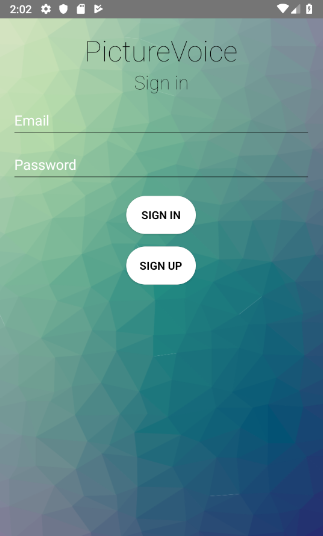
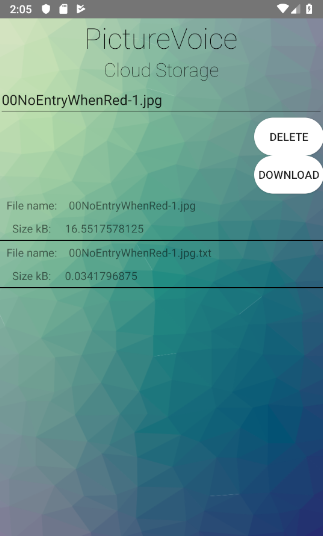

# PictureVoice

## Project information
```
IDE: Android Studio
Programming language: Java
```

## Description
```
PictureVoice lets users snap pictures and quickly extract the text from the picture
and have the text read out loud by using Google Text Recognition machine learning 
algorithm and Android Text-To-Speech synthesizer. The picture and text can then be stored
in the cloud. When storing files on the cloud a record of stored files is also kept in
a realtime database to be able to maintain a synced record of stored files across many devices.
The application is developed on the Google Firebase platform. The development group included
two students and was developed during the course Software Development for the Cloud at
Högskolan Kristianstad. 
```

## Learning outcomes
```
*Google Firebase platform
*Google Text Recognition machine learning algorithm
*Google Cloud Storage
*Google Cloud Security Rules
*Realtime database
*Android Text-To-Speech synthesizer
```

# Login & Picture-To-Text
&emsp;
# Picture-To-Text & Cloud Profile
&emsp;
